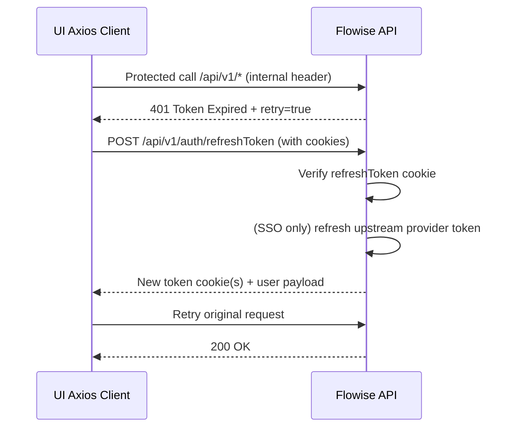

# Flowise Authentication Flow

This document explains how authentication and authorization currently work across the Flowise server and UI in this repository.

## 1) Authentication modes at a glance

| Mode | Primary credential | Typical caller | Where enforced |
| --- | --- | --- | --- |
| Interactive UI auth | `connect.sid` + `token` cookie (+ `refreshToken`) | Browser UI (`packages/ui`) | Passport session + JWT middleware (`packages/server/src/enterprise/middleware/passport`) |
| SSO auth | Provider OAuth/OIDC + Flowise cookies | Browser UI | SSO providers (`packages/server/src/enterprise/sso/*`) |
| Platform API key auth | `Authorization: Bearer <apiKey>` | External service/system API clients | Global API gate in `packages/server/src/index.ts` |
| Chatflow API key auth | `Authorization: Bearer <apiSecret>` | Public chatbot/prediction callers | `validateChatflowAPIKey` in flow execution path |

## 2) Server request gate (first auth decision point)

The main gate is in `packages/server/src/index.ts` and runs before `/api/v1` routers.

```mermaid
flowchart TD
    A[Incoming request] --> B{Path starts with /api/v1 and exact case?}
    B -- no --> Z[Allow through: static/ui/non-api paths]
    B -- yes --> C{Path is whitelisted?}
    C -- yes --> D[Allow request without session JWT/API key gate]
    C -- no --> E{Header x-request-from=internal?}
    E -- yes --> F[verifyToken via Passport JWT + session]
    E -- no --> G[Validate platform API key bearer token]
    G --> H{API key valid and workspace resolvable?}
    H -- no --> I[401 Unauthorized Access]
    H -- yes --> J[Inject req.user (workspace/org/permissions/features)]
    J --> K[Continue to route handlers]
```

### Important implication

- UI requests are expected to send `x-request-from: internal`.
- External service calls typically do **not** send this header and instead use API key authentication.

## 3) UI login (email/password)

### 3.1 Route resolution

1. UI opens `/login`.
2. `POST /api/v1/auth/resolve` decides target page:
   - `/organization-setup` (initial setup cases)
   - `/signin` (normal sign-in)
   - `/license-expired` (enterprise license invalid)

### 3.2 Sign-in

1. UI sends `POST /api/v1/auth/login` with `{ email, password }`.
2. Server uses Passport local strategy (`'login'`):
   - Validates user credentials via `AccountService.login`.
   - Loads workspace/org/role/features into a `LoggedInUser`.
3. Server calls `req.login(...)` to create Passport session.
4. Server sets cookies via `setTokenOrCookies`:
   - `token` (JWT, HTTP-only)
   - `refreshToken` (JWT, HTTP-only)
   - plus `connect.sid` (session cookie from express-session)
5. UI stores returned user/permissions/features in Redux + localStorage.

### Cookie behavior

- Cookies are `httpOnly`, `sameSite=lax`.
- `secure=true` when `APP_URL` is HTTPS.

## 4) Hybrid session + JWT behavior (internal API calls)

UI axios client (`packages/ui/src/api/client.js`) sends:

- `withCredentials: true`
- header `x-request-from: internal`

For protected routes, `verifyToken` is used:

1. Passport JWT extracts `token` cookie.
2. JWT strategy validates signature and token payload.
3. Strategy also expects `req.user` from Passport session and checks encrypted token metadata against that user identity.
4. If valid, request proceeds with `req.user` context.

This creates a hybrid model: session context + JWT cookie are both part of normal UI auth.

## 5) Token refresh flow

When access token expires, the server returns:

- `401` with `{ message: "Token Expired", retry: true }` (when refresh cookie exists)

UI interceptor then performs refresh:



## 6) Logout flow

1. UI sends `POST /api/v1/account/logout`.
2. Server:
   - records audit event (enterprise),
   - logs out Passport session,
   - destroys session / clears auth cookies.
3. Response includes `redirectTo: "/login"`.
4. UI dispatches `logoutSuccess`, clears local auth state, redirects.

## 7) SSO flow

Supported providers (configurable): Azure, Google, Auth0, GitHub.

```mermaid
flowchart TD
    A[User clicks SSO button in UI] --> B[/api/v1/{provider}/login]
    B --> C[Redirect to provider consent/login]
    C --> D[/api/v1/{provider}/callback]
    D --> E[Provider strategy resolves profile/email]
    E --> F[SSOBase.verifyAndLogin]
    F --> G{User exists?}
    G -- no + cloud --> H[Auto-register user/workspace]
    G -- no + enterprise --> I[Fail login]
    G -- invited --> J[Complete invite registration]
    G -- yes --> K[Build LoggedInUser]
    H --> K
    J --> K
    K --> L[req.login session + setTokenOrCookies]
    L --> M[Redirect /sso-success?user=...]
    M --> N[UI dispatches loginSuccess and navigates]
```

### SSO token notes

- `LoggedInUser` may contain provider access/refresh tokens server-side.
- These are removed from returned safe copies before UI state persistence.

## 8) Registration, verification, and password reset

### Registration patterns

- **Open Source**: typically first admin via `/organization-setup`.
- **Cloud**:
  - account creation can produce an `unverified` user,
  - verification email/token flow required for email/password signups.
- **Enterprise**:
  - invitation-based registration (token),
  - SSO can activate invited users.

### Email verification

1. User opens `/verify?token=<tempToken>`.
2. UI calls `POST /api/v1/account/verify`.
3. Server validates temp token and activates account.

### Forgot/reset password

1. `POST /api/v1/account/forgot-password` sends reset token email.
2. `POST /api/v1/account/reset-password` validates token and updates password hash.

## 9) Workspace switching and auth context

When UI switches workspaces (`POST /api/v1/workspace/switch?id=...`):

1. Server validates workspace membership and statuses.
2. Server updates `req.user` and `req.session.passport.user` with:
   - active workspace
   - org/subscription context
   - permissions/features
3. UI updates auth state (`workspaceSwitchSuccess`) and reloads.

This is how active workspace authorization context changes after login.

## 10) API key authentication flows

### 10.1 Platform API key (non-internal protected APIs)

Used when request is not whitelisted and not marked internal:

1. Provide `Authorization: Bearer <apiKey>`.
2. Server validates hashed secret against stored keys.
3. Server resolves workspace and injects `req.user` context for RBAC/feature checks.

### 10.2 Chatflow API key (public prediction/vector routes)

For chatflows with an attached `apikeyid`:

1. Caller sends `Authorization: Bearer <secret>`.
2. Execution path validates key against chatflow-linked key.
3. Request proceeds only if matched.

## 11) Authorization (RBAC + feature flags)

After authentication, route access is filtered by:

- Permission middleware: `checkPermission`, `checkAnyPermission`
- Feature flag middleware: `IdentityManager.checkFeatureByPlan`
- UI route guard: `RequireAuth` (`packages/ui/src/routes/RequireAuth.jsx`)

In enterprise/cloud, both permission and feature checks matter for many pages/routes.

## 12) Operational notes / troubleshooting

| Symptom | Likely area to inspect |
| --- | --- |
| Repeated redirect to login | Missing/expired cookies, session store issues, `verifyToken` failures |
| 401 with `Token Expired` loops | `/auth/refreshToken` response, refresh cookie validity, axios retry |
| SSO callback fails | Provider config in login methods, callback URL mismatch, provider disabled |
| Access denied (403) after login | Missing permission or feature flag; check `req.user.permissions/features` |
| External API call rejected | Missing Bearer API key, wrong key scope/workspace mapping |

---

## File map for further tracing

- Global API auth gate: `packages/server/src/index.ts`
- JWT/session middleware: `packages/server/src/enterprise/middleware/passport/index.ts`
- JWT strategy: `packages/server/src/enterprise/middleware/passport/AuthStrategy.ts`
- Session persistence strategy: `packages/server/src/enterprise/middleware/passport/SessionPersistance.ts`
- SSO providers: `packages/server/src/enterprise/sso/*`
- UI auth client/interceptor: `packages/ui/src/api/client.js`
- UI auth state: `packages/ui/src/store/reducers/authSlice.js`
- UI route guard: `packages/ui/src/routes/RequireAuth.jsx`
- Chatflow API key checks: `packages/server/src/utils/validateKey.ts`

