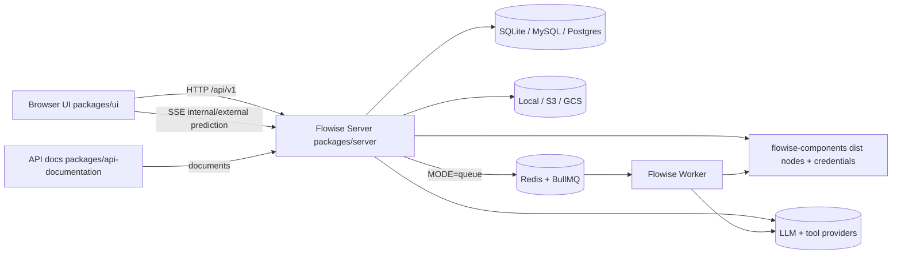
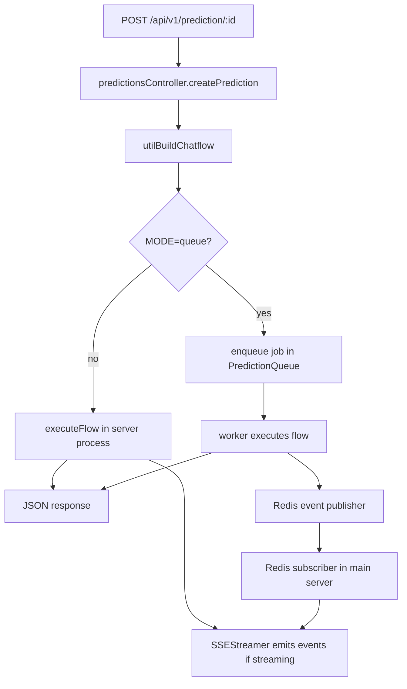
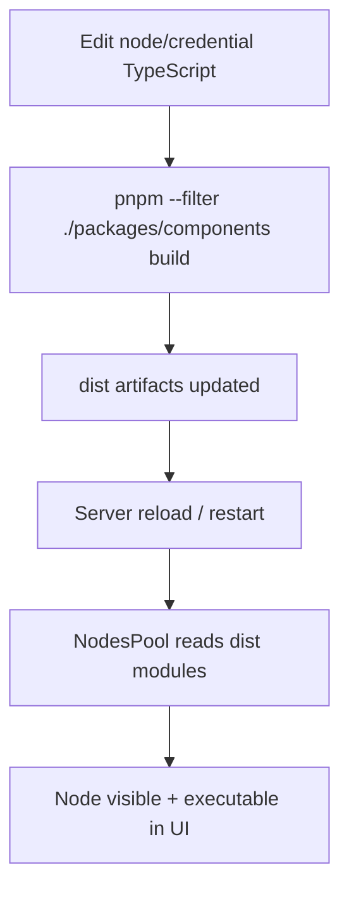
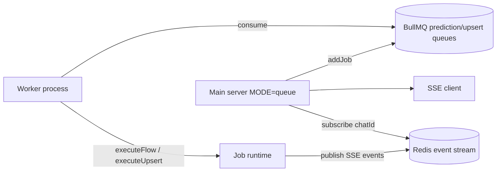

# Flowise Local Development and Debugging Guide

This guide is based on a review of the current monorepo structure and runtime paths in this repository. It is focused on practical local development and debugging for each major project portion.

## 1) Project map (major portions)

| Portion | Path | What it does |
| --- | --- | --- |
| Server | `packages/server` | Express API, auth, flow execution, SSE streaming, queue orchestration |
| UI | `packages/ui` | React + Vite frontend, routes, API client, canvas/chat UX |
| Components | `packages/components` | Node/credential integrations loaded by server at runtime |
| Worker/Queue mode | `packages/server` + Redis | Background prediction/upsert execution via BullMQ |
| API documentation | `packages/api-documentation` | Swagger UI server for public API docs |

## 2) Architecture overview



## 3) Prerequisites

- Node.js: `>=18.15.0 <19 || ^20` (Node 20 recommended)
- pnpm: `>=9`
- Optional but common:
  - Docker/Desktop (for Redis and queue stack)
  - Redis locally (for queue mode)

## 4) Initial local setup (recommended baseline)

From repo root:

```bash
pnpm install
pnpm build
cp packages/server/.env.example packages/server/.env
cp packages/ui/.env.example packages/ui/.env
```

Suggested defaults:

- `packages/server/.env`:
  - `PORT=3000`
- `packages/ui/.env`:
  - `VITE_PORT=8080`
  - optional `VITE_API_BASE_URL=http://localhost:3000` if not using same-origin

Run full dev mode:

```bash
pnpm dev
```

Notes:

- UI dev server runs on `http://localhost:8080` by default.
- Server runs on `http://localhost:3000` by default.
- `pnpm dev` covers UI + server; **components changes require rebuild** (details below).

## 5) Major portion runbooks

### 5.1 Server (`packages/server`)

### What to know

- Entry/start path:
  - CLI command `start` -> `packages/server/src/commands/start.ts`
  - App bootstrap -> `packages/server/src/index.ts`
- Central API router -> `packages/server/src/routes/index.ts`
- Prediction execution path:
  - route: `routes/predictions/index.ts`
  - controller: `controllers/predictions/index.ts`
  - orchestration: `utils/buildChatflow.ts`

### Run modes

From repo root:

```bash
pnpm start
```

Server-only (no UI dev server):

```bash
pnpm --filter ./packages/server start
```

TypeScript command mode (useful while iterating server logic):

```bash
pnpm --filter ./packages/server oclif-dev
```

### Debugger attach (Node inspector)

```bash
NODE_OPTIONS="--inspect=9229" pnpm --filter ./packages/server start
```

Then attach your IDE to `localhost:9229`.

### Key health checks

```bash
curl http://localhost:3000/api/v1/ping
```

### Log locations

- Default server logs directory: `packages/server/logs`
- Request log file: `server-requests.log.jsonl`
- Override with `LOG_PATH` and `LOG_LEVEL`
- Set `DEBUG=true` for extra verbose diagnostics

### Prediction flow (normal vs queue mode)



### Server debugging checklist

1. Confirm startup sequence in logs: DataSource init -> migrations -> nodes pool init.
2. If auth errors appear, inspect middleware in `src/index.ts` (JWT/API key checks).
3. If a prediction hangs:
   - check `controllers/predictions/index.ts`
   - set breakpoints in `utilBuildChatflow` and `executeFlow` (`utils/buildChatflow.ts`)
4. If streaming fails, inspect:
   - SSE client registration in prediction controller
   - `utils/SSEStreamer.ts`
   - queue mode subscriber path when `MODE=queue`

---

### 5.2 UI (`packages/ui`)

### What to know

- Entrypoint: `src/index.jsx`
- Router root: `src/routes/index.jsx`
- Main protected routes: `src/routes/MainRoutes.jsx`
- API client: `src/api/client.js` (axios base `/api/v1`, internal header, token refresh)
- Base URL constants: `src/store/constant.js`

### Run UI only

```bash
pnpm --filter ./packages/ui dev
```

Vite proxy behavior:

- In development, `vite.config.js` reads `../server/.env` (`HOST`/`PORT`) and proxies `/api/*` to server.

### UI debugging checklist

1. Verify API base/proxy:
   - `VITE_API_BASE_URL` in `.env` (or proxy defaults).
2. Check browser Network tab for failing `/api/v1/*` calls.
3. If auth loops happen:
   - inspect interceptor in `src/api/client.js` (401 + refresh token logic).
4. Route issues:
   - validate route definitions in `src/routes/*.jsx`.
5. Streaming issues:
   - inspect consumer logic in `views/chatmessage/ChatMessage.jsx` (`fetchEventSource` path).

---

### 5.3 Components (`packages/components`)

### What to know

- Server loads component code from **compiled** artifacts:
  - nodes: `dist/nodes`
  - credentials: `dist/credentials`
- Loader implementation: `packages/server/src/NodesPool.ts`
- Build pipeline:
  - `tsc` compile + `gulp` icon copy (`packages/components/gulpfile.ts`)

### Typical component development loop

1. Edit node/credential sources under:
   - `packages/components/nodes/...`
   - `packages/components/credentials/...`
2. Rebuild:

```bash
pnpm --filter ./packages/components build
```

3. Restart server if needed (or let your dev runner reload).
4. Validate node visibility and execution in UI canvas.



### Component debugging checklist

If a node is missing from UI:

1. Confirm build completed successfully.
2. Check runtime filters in `NodesPool.ts`:
   - `DISABLED_NODES`
   - community-node visibility (`SHOW_COMMUNITY_NODES`)
3. Confirm your module exports expected class symbol:
   - nodes: `module.exports = { nodeClass: ... }`
   - credentials: `module.exports = { credClass: ... }`

If a node executes incorrectly:

1. Set server breakpoints at:
   - `utils/buildChatflow.ts` (execution orchestration)
   - node `init`/`run` implementation in components package
2. Enable `DEBUG=true` and inspect request + server logs.

---

### 5.4 Worker/queue mode (Redis + BullMQ)

Queue mode is the main scaling path: main server enqueues jobs, workers process them.

### Local queue setup (source-based)

1. Start Redis:

```bash
docker run --name flowise-redis -p 6379:6379 -d redis:alpine
```

2. Update `packages/server/.env` (minimum):

```env
MODE=queue
QUEUE_NAME=flowise-queue
REDIS_URL=redis://localhost:6379
ENABLE_BULLMQ_DASHBOARD=true
```

3. Start main server:

```bash
pnpm start
```

4. Start worker (second terminal):

```bash
pnpm start-worker
```

### Queue flow



### Queue debugging checklist

1. Confirm Redis reachable (`REDIS_URL` or host/port vars).
2. Check that `MODE=queue` is set for both main and worker.
3. Verify worker startup logs show prediction/upsert workers created.
4. Open BullMQ dashboard (if enabled): `http://localhost:3000/admin/queues`
5. Attach debugger to worker:

```bash
NODE_OPTIONS="--inspect=9230" pnpm start-worker
```

---

### 5.5 API documentation (`packages/api-documentation`)

### What to know

- Entrypoint: `packages/api-documentation/src/index.ts`
- Swagger config: `src/configs/swagger.config.ts`
- Primary spec source: `src/yml/swagger.yml`
- Served at: `http://localhost:6655/api-docs`

### Run

Server and docs should both be up.

Terminal 1:

```bash
pnpm start
```

Terminal 2:

```bash
pnpm --filter ./packages/api-documentation build
pnpm --filter ./packages/api-documentation start
```

Optional watch mode while editing docs:

```bash
pnpm --filter ./packages/api-documentation exec tsc-watch --onSuccess "node dist/index.js"
```

### API docs debugging checklist

1. Verify docs server startup on port `6655`.
2. If endpoint docs seem stale:
   - rebuild `packages/api-documentation`
   - ensure edits were made in `src/yml/swagger.yml`
3. Confirm target server in docs matches local API (`http://localhost:3000/api/v1`).

## 6) Suggested terminal layout for full-stack work

Terminal A:

```bash
pnpm dev
```

Terminal B (when changing components):

```bash
pnpm --filter ./packages/components build
```

Terminal C (optional queue mode):

```bash
pnpm start-worker
```

Terminal D (optional API docs):

```bash
pnpm --filter ./packages/api-documentation build && pnpm --filter ./packages/api-documentation start
```

## 7) Fast troubleshooting table

| Symptom | First checks |
| --- | --- |
| UI cannot reach API | `packages/server/.env` port, Vite proxy, browser network errors |
| Prediction returns 500 | `controllers/predictions`, `utils/buildChatflow`, server logs |
| Streaming hangs | SSE headers/client registration, queue subscriber path, Redis connectivity |
| Node not visible in canvas | rebuild components, `DISABLED_NODES`, community-node gating |
| Queue jobs stuck | worker not running, Redis URL mismatch, BullMQ dashboard |
| Auth keeps resetting | axios interceptor refresh path, JWT env values, cookies/withCredentials |

## 8) Production-like verification before pushing major changes

From repo root:

```bash
pnpm build
pnpm start
```

Then verify:

- `GET /api/v1/ping` returns `pong`
- UI loads and can create/run a simple chatflow
- (if used) queue mode and worker process jobs successfully

