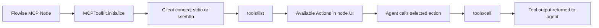

# Creating a Custom Component in Flowise Using MCP

This guide shows two ways to create a custom MCP-powered component in this repository:

1. **No-code/low-code**: Use the built-in **Custom MCP** node in the UI.
2. **Code-level**: Add a brand-new dedicated MCP component under `packages/components`.

Both approaches use the same MCP runtime bridge in:

- `packages/components/nodes/tools/MCP/core.ts`

---

## 1) How MCP integration works in Flowise

At runtime, Flowise MCP tool nodes do this:

1. Build MCP connection parameters (`stdio` process or remote `sse/http` endpoint).
2. Initialize `MCPToolkit`.
3. Call MCP `tools/list`.
4. Expose each MCP tool as a LangChain-compatible `Tool`.
5. On execution, call MCP `tools/call`.



Flowise loads custom components from compiled artifacts:

- Nodes: `flowise-components/dist/nodes`
- Credentials: `flowise-components/dist/credentials`
- Loader: `packages/server/src/NodesPool.ts`

So after changing component code, you must rebuild `packages/components`.

---

## 2) Fast path: create a custom MCP component with the built-in **Custom MCP** node

Use this when you do **not** need a new TypeScript node file.

### Step 1: Add a **Custom MCP** node in the canvas

- In UI, open the node picker category **Tools (MCP)**.
- Add **Custom MCP**.

### Step 2: Fill **MCP Server Config**

The node accepts JSON-like config for either:

- **Stdio/local process** (when `command` is present)
- **Remote streamable HTTP/SSE** (when `command` is absent and `url` is used)

#### Example A: local stdio MCP server

```json
{
    "command": "npx",
    "args": ["-y", "@modelcontextprotocol/server-filesystem", "/path/to/allowed/files"]
}
```

#### Example B: remote MCP endpoint with auth header

```json
{
    "url": "https://your-mcp-endpoint.example.com/sse",
    "headers": {
        "Authorization": "Bearer {{$vars.MCP_API_TOKEN}}"
    }
}
```

Variable substitution is supported via `{{$vars.<name>}}` (implemented in `CustomMCP.ts`).

### Step 3: Load and select actions

- Click refresh on **Available Actions**.
- Select only the MCP actions you want to expose to your agent.

### Step 4: Connect to an Agent node and test

- Attach **Custom MCP** to your Agent.
- Ask a prompt that should trigger one of the selected MCP actions.

---

## 3) Code path: create a brand-new MCP component

Use this when you want a first-class node (custom label, icon, credential type, docs link, defaults).

## 3.1 Create the node file

Create a folder like:

- `packages/components/nodes/tools/MCP/Acme/`

Add:

- `AcmeMCP.ts`
- `acme.svg` (or `.png/.jpg`)

Minimal template (based on existing MCP nodes):

```ts
import { Tool } from '@langchain/core/tools'
import { ICommonObject, INode, INodeData, INodeOptionsValue, INodeParams } from '../../../../src/Interface'
import { getCredentialData, getCredentialParam, getNodeModulesPackagePath } from '../../../../src/utils'
import { MCPToolkit } from '../core'

class Acme_MCP implements INode {
    label: string
    name: string
    version: number
    description: string
    type: string
    icon: string
    category: string
    baseClasses: string[]
    documentation: string
    credential: INodeParams
    inputs: INodeParams[]

    constructor() {
        this.label = 'Acme MCP'
        this.name = 'acmeMCP'
        this.version = 1.0
        this.type = 'Acme MCP Tool'
        this.icon = 'acme.svg'
        this.category = 'Tools (MCP)'
        this.description = 'MCP server for Acme APIs'
        this.documentation = 'https://github.com/your-org/your-mcp-server'
        this.credential = {
            label: 'Connect Credential',
            name: 'credential',
            type: 'credential',
            credentialNames: ['acmeApi']
        }
        this.inputs = [
            {
                label: 'Available Actions',
                name: 'mcpActions',
                type: 'asyncMultiOptions',
                loadMethod: 'listActions',
                refresh: true
            }
        ]
        this.baseClasses = ['Tool']
    }

    // @ts-ignore
    loadMethods = {
        listActions: async (nodeData: INodeData, options: ICommonObject): Promise<INodeOptionsValue[]> => {
            try {
                const toolset = await this.getTools(nodeData, options)
                toolset.sort((a: any, b: any) => a.name.localeCompare(b.name))

                return toolset.map(({ name, ...rest }) => ({
                    label: name.toUpperCase(),
                    name,
                    description: rest.description || name
                }))
            } catch (error) {
                return [
                    {
                        label: 'No Available Actions',
                        name: 'error',
                        description: 'No available actions, check credentials/server config and refresh'
                    }
                ]
            }
        }
    }

    async init(nodeData: INodeData, _: string, options: ICommonObject): Promise<any> {
        const tools = await this.getTools(nodeData, options)

        const _mcpActions = nodeData.inputs?.mcpActions
        let mcpActions = []
        if (_mcpActions) {
            mcpActions = typeof _mcpActions === 'string' ? JSON.parse(_mcpActions) : _mcpActions
        }

        return tools.filter((tool: any) => mcpActions.includes(tool.name))
    }

    async getTools(nodeData: INodeData, options: ICommonObject): Promise<Tool[]> {
        const credentialData = await getCredentialData(nodeData.credential ?? '', options)
        const apiKey = getCredentialParam('apiKey', credentialData, nodeData)

        const packagePath = getNodeModulesPackagePath('@your-org/mcp-server-acme/dist/index.js')

        const serverParams = {
            command: 'node',
            args: [packagePath],
            env: {
                ACME_API_KEY: apiKey
            }
        }

        const toolkit = new MCPToolkit(serverParams, 'stdio')
        await toolkit.initialize()

        return (toolkit.tools ?? []) as Tool[]
    }
}

module.exports = { nodeClass: Acme_MCP }
```

## 3.2 (Optional but recommended) Add a credential type

Create:

- `packages/components/credentials/AcmeApi.credential.ts`

```ts
import { INodeParams, INodeCredential } from '../src/Interface'

class AcmeApi implements INodeCredential {
    label: string
    name: string
    version: number
    inputs: INodeParams[]

    constructor() {
        this.label = 'Acme API'
        this.name = 'acmeApi'
        this.version = 1.0
        this.inputs = [
            {
                label: 'API Key',
                name: 'apiKey',
                type: 'password'
            }
        ]
    }
}

module.exports = { credClass: AcmeApi }
```

## 3.3 Install MCP server package (if needed)

If your MCP server is from npm, add it to `packages/components`:

```bash
pnpm --filter ./packages/components add @your-org/mcp-server-acme
```

If you run your server remotely over HTTP/SSE, you may not need a new package dependency.

## 3.4 Build and restart

```bash
pnpm --filter ./packages/components build
```

Then restart the Flowise server process.

## 3.5 Validate in UI

1. Open node picker -> **Tools (MCP)**.
2. Confirm your new node appears.
3. Attach credential.
4. Refresh **Available Actions**.
5. Select actions and run a chatflow test.

---

## 4) End-to-end flow for a new MCP component

```mermaid
flowchart TD
    A[Create MCP node + optional credential TS files] --> B[Install MCP server package if needed]
    B --> C[pnpm --filter ./packages/components build]
    C --> D[Server loads dist nodes via NodesPool]
    D --> E[Node visible in Tools (MCP)]
    E --> F[Refresh Available Actions tools/list]
    F --> G[Agent executes selected action tools/call]
```

---

## 5) Troubleshooting

| Symptom | Likely cause | What to check |
| --- | --- | --- |
| Node does not appear in UI | Component not built or wrong export | `pnpm --filter ./packages/components build`, ensure `module.exports = { nodeClass: ... }` |
| Credential missing | Credential file/export mismatch | Ensure `*.credential.ts` and `module.exports = { credClass: ... }` |
| "No Available Actions" | MCP server unreachable/invalid auth | Check credential values, server startup, `serverParams` |
| "URL is required for SSE transport" | Missing `command` and missing `url` | Provide valid `url` for remote mode |
| Icon not shown | Icon not copied to dist | Keep icon beside node file; build runs gulp copy (`nodes/**/*.{jpg,png,svg}`) |
| Action list empty | MCP server does not expose tools | Verify MCP server supports `tools/list` |

---

## 6) Recommended best practices

- Keep secrets in Flowise credentials or variables (`$vars`), not hardcoded strings.
- Expose only required actions through `mcpActions`.
- Prefer dedicated credential types for reusable production nodes.
- Keep category as `Tools (MCP)` and `baseClasses = ['Tool']` for consistent behavior.

